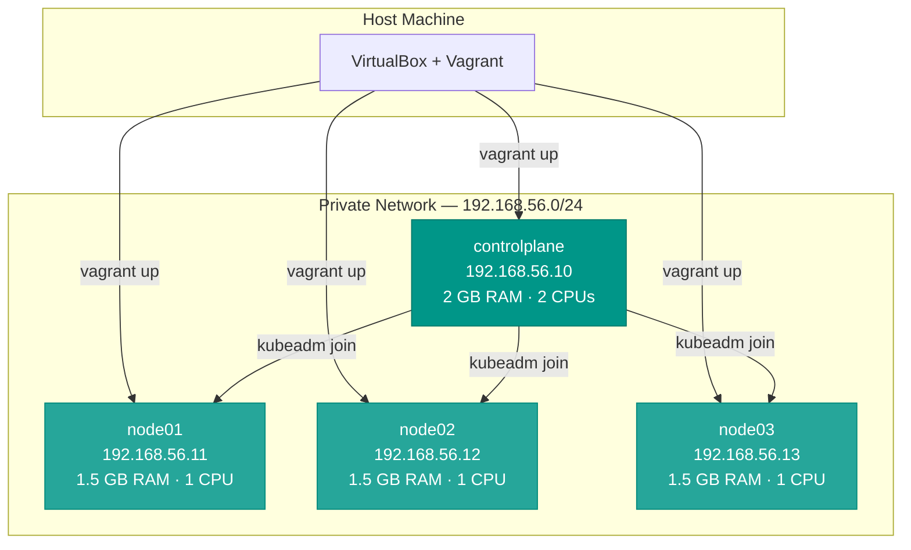
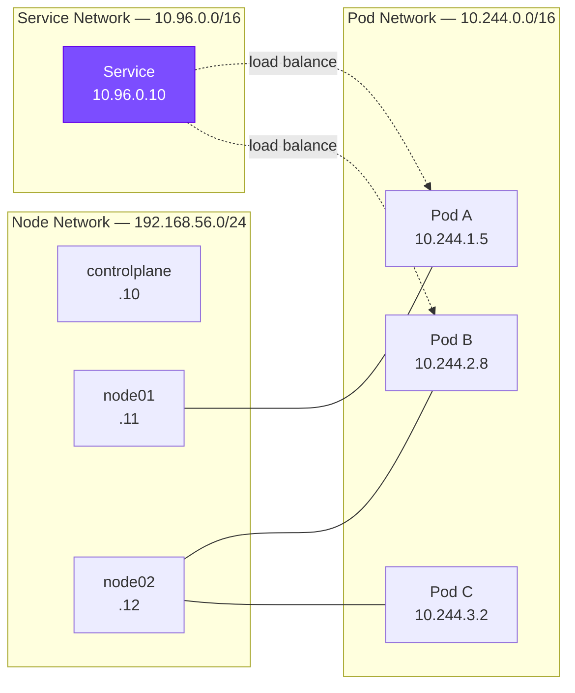
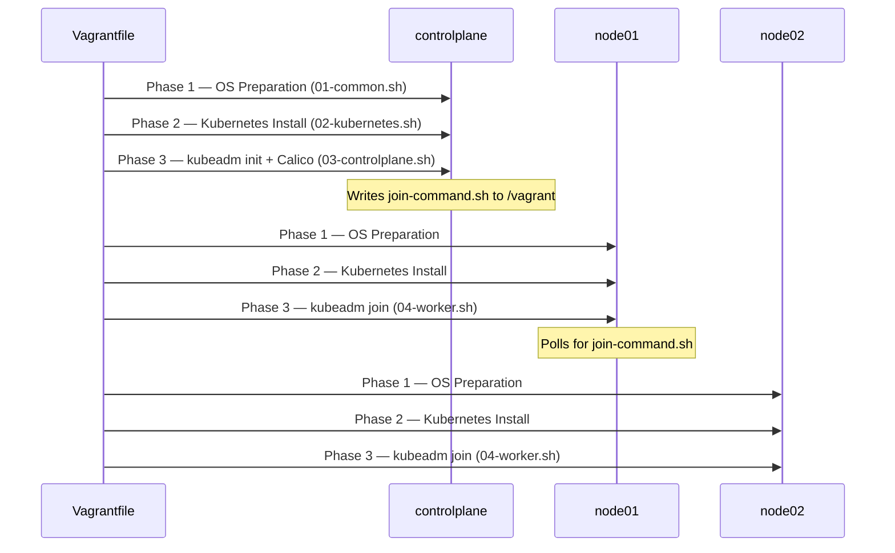
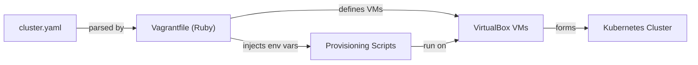

# Architecture

This page explains the architecture of a KubeAuto-provisioned cluster, including the VM topology, network design, and provisioning sequence.

---

## Cluster Topology

---

## Network Architecture

KubeAuto configures three network layers:

### 1. Host-Only Network (Node-to-Node)

A VirtualBox private network on `192.168.56.x`. This is the primary network for inter-node communication and API server access.

### 2. Pod Network (Container-to-Container)

Calico CNI overlay network on `10.244.0.0/16`. Every pod gets a unique IP from this range. Calico handles routing between pods across nodes using BGP.

### 3. Service Network (Service Discovery)

Kubernetes ClusterIP service range on `10.96.0.0/16`. Used internally by kube-proxy for service load balancing.

---

## Component Stack

Each VM runs the following software stack:

| Layer             | Component                  | Notes                          |
|------------------|---------------------------|--------------------------------|
| Operating System | Ubuntu 22.04 LTS (Jammy)  | Vagrant box `ubuntu/jammy64`   |
| Container Runtime| containerd                 | SystemdCgroup enabled          |
| Kubernetes       | kubelet, kubeadm, kubectl  | Latest stable, auto-detected   |
| CNI              | Calico v3.31.5             | Via Tigera operator            |
| Networking       | kube-proxy                 | iptables mode (default)        |

---

## Provisioning Sequence

The Vagrantfile provisions nodes sequentially in the order defined in `cluster.yaml`. Each node goes through three phases:

### Phase Details

| Phase | Script              | Runs On    | Purpose                                           |
|-------|---------------------|------------|---------------------------------------------------|
| 1     | `01-common.sh`      | All nodes  | Disable swap, load kernel modules, apply sysctl   |
| 2     | `02-kubernetes.sh`  | All nodes  | Install containerd, kubeadm, kubelet, kubectl     |
| 3     | `03-controlplane.sh`| CP only    | `kubeadm init`, deploy Calico, write join command |
| 3     | `04-worker.sh`      | Workers    | Poll for join command, execute `kubeadm join`     |

---

## File Coordination

The control plane and worker nodes coordinate through the Vagrant synced folder (`/vagrant`):

1. **Control plane** runs `kubeadm init` and generates a join token
2. The join command is saved to `/vagrant/join-command.sh` (visible to all VMs)
3. **Workers** poll for this file (up to 5 minutes) and execute it when found

This eliminates the need for SSH between VMs or external coordination services.

---

## Configuration Flow

All cluster decisions flow from `cluster.yaml` → `Vagrantfile` → provisioning scripts. No script editing is required for normal use.
