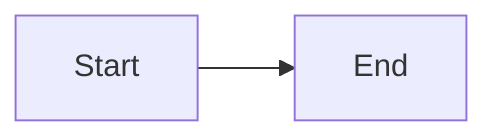

# Documentation Implementation Guide

This document explains how the KubeAuto documentation site is structured, built, and deployed. Follow this guide to add, edit, or extend the documentation without AI assistance.

---

## Technology Stack

| Component        | Tool                          | Purpose                                |
|-----------------|-------------------------------|----------------------------------------|
| Static site gen | MkDocs                        | Converts Markdown to HTML              |
| Theme           | Material for MkDocs           | Modern, responsive theme with dark mode|
| Hosting         | GitHub Pages                  | Free static site hosting               |
| CI/CD           | GitHub Actions                | Automated build and deploy on push     |
| Markdown lint   | markdownlint-cli              | Validates Markdown formatting          |

---

## Project Structure

```
kubeadm-automation/
├── mkdocs.yml                  ← Main MkDocs configuration file
├── requirements-docs.txt       ← Python dependencies (pinned versions)
├── overrides/
│   └── home.html               ← Custom landing page template
├── docs/
│   ├── index.md                ← Landing page metadata
│   ├── faq.md                  ← FAQ page
│   ├── stylesheets/
│   │   └── extra.css           ← Custom CSS (light + dark mode)
│   ├── javascripts/
│   │   └── extra.js            ← Custom JavaScript
│   ├── assets/
│   │   └── hero.png            ← Hero section illustration
│   ├── getting-started/
│   │   ├── prerequisites.md
│   │   ├── system-requirements.md
│   │   ├── architecture.md
│   │   └── quick-start.md
│   ├── installation/
│   │   ├── installation-guide.md
│   │   └── configuration.md
│   ├── usage/
│   │   ├── basic-usage.md
│   │   ├── advanced-options.md
│   │   └── multi-node-cluster.md
│   ├── examples/
│   │   ├── index.md
│   │   ├── sample-configurations.md
│   │   └── example-scenarios.md
│   ├── operations/
│   │   ├── cluster-management.md
│   │   └── troubleshooting.md
│   ├── reference/
│   │   ├── index.md
│   │   ├── configuration-reference.md
│   │   ├── scripts-reference.md
│   │   └── environment-variables.md
│   └── about/
│       ├── index.md
│       ├── contributing.md
│       └── release-notes.md
├── documentation/
│   └── implementation.md       ← This file (not published to the site)
└── .github/
    └── workflows/
        └── deploy-docs.yml     ← CI/CD pipeline
```

---

## How to Preview Locally

### One-Time Setup

```bash
# Install Python 3.12+ if not already installed

# Install docs dependencies
pip install -r requirements-docs.txt
```

### Start the Local Preview Server

```bash
mkdocs serve
```

Open [http://127.0.0.1:8000/](http://127.0.0.1:8000/) in your browser. The page auto-reloads when you save changes.

### Build Without Serving

```bash
mkdocs build --strict
```

The built site is written to the `site/` directory. The `--strict` flag fails on any warning (same as CI).

---

## How to Add a New Documentation Page

### Step 1: Create the Markdown File

Create a new `.md` file in the appropriate directory under `docs/`. Use this frontmatter template:

```markdown
---
title: Your Page Title
description: A brief description of the page content
---

# Your Page Title

Your content here...
```

### Step 2: Add the Page to Navigation

Open `mkdocs.yml` and add the page to the `nav` section in the correct location:

```yaml
nav:
  - Guides:
    - Getting Started:
      - Your New Page: getting-started/your-new-page.md  # ← add here
```

### Step 3: Preview and Verify

```bash
mkdocs serve
```

Navigate to your new page and verify it renders correctly.

### Step 4: Commit and Push

```bash
git add docs/getting-started/your-new-page.md mkdocs.yml
git commit -m "docs(getting-started): add your-new-page guide"
git push origin main
```

The CI/CD pipeline will automatically lint, build, and deploy your changes.

---

## How to Modify Navigation Structure

All navigation is controlled by the `nav` key in `mkdocs.yml`:

```yaml
nav:
  - Tab Name:
    - Section Name:
      - Page Title: path/to/file.md
```

### Rules

- **Top-level items** become horizontal tabs (e.g., Home, Guides, Reference)
- **Second-level items** become sidebar sections
- **Third-level items** become sidebar pages within a section
- **File paths** are relative to the `docs/` directory

### Adding a New Section

```yaml
nav:
  - Guides:
    - Getting Started:
      - ...
    - Your New Section:                    # ← new section
      - Page One: new-section/page-one.md  # ← new page
      - Page Two: new-section/page-two.md  # ← new page
```

### Adding a Section Index Page

Use `navigation.indexes` by listing the index file directly under the section:

```yaml
nav:
  - Reference:
    - reference/index.md              # ← section index page
    - Configuration: reference/config.md
```

---

## Markdown Features Available

### Admonitions (Callout Boxes)

```markdown
!!! note "Optional Title"
    This is a note.

!!! warning
    This is a warning.

!!! tip
    This is a tip.

!!! danger
    This is a danger alert.

!!! info
    This is informational.
```

Available types: `note`, `abstract`, `info`, `tip`, `success`, `question`, `warning`, `failure`, `danger`, `bug`, `example`, `quote`.

### Collapsible Admonitions

```markdown
??? note "Click to expand"
    Hidden content here.

???+ note "Expanded by default"
    Visible content here.
```

### Tabbed Content

```markdown
=== "Tab 1"
    Content for tab 1.

=== "Tab 2"
    Content for tab 2.
```

### Code Blocks with Syntax Highlighting

````markdown
```python title="example.py" linenums="1"
def hello():
    print("Hello, World!")
```
````

Supported languages: `bash`, `yaml`, `python`, `ruby`, `json`, `powershell`, and many more.

### Task Lists

```markdown
- [x] Completed task
- [ ] Incomplete task
```

### Tables

```markdown
| Column 1 | Column 2 | Column 3 |
|----------|----------|----------|
| Cell 1   | Cell 2   | Cell 3   |
```

### Mermaid Diagrams

````markdown

````

### Emojis

```markdown
:material-check: :fontawesome-brands-github: :octicons-arrow-right-24:
```

Browse all icons at: [Material Design Icons](https://pictogrammers.com/library/mdi/), [FontAwesome](https://fontawesome.com/icons), [Octicons](https://primer.style/octicons/).

---

## How to Customise Styling

### CSS Custom Properties

Edit `docs/stylesheets/extra.css`. Key CSS variables:

```css
:root {
  --ka-primary: #009688;        /* Primary teal colour */
  --ka-primary-dark: #00796b;   /* Darker teal for hover states */
  --ka-surface: #ffffff;        /* Background colour */
  --ka-border: #e0e0e0;         /* Border colour */
  --ka-radius: 12px;            /* Border radius for cards */
}

[data-md-color-scheme="slate"] {
  --ka-primary: #26a69a;        /* Teal for dark mode */
  --ka-surface: #1e1e2e;        /* Dark background */
  --ka-border: #2d2d44;         /* Dark border */
}
```

### Changing the Colour Palette

In `mkdocs.yml`, change the `primary` and `accent` values:

```yaml
theme:
  palette:
    - scheme: default
      primary: indigo     # Change from teal to indigo
      accent: pink        # Change accent colour
```

Available colours: `red`, `pink`, `purple`, `deep-purple`, `indigo`, `blue`, `light-blue`, `cyan`, `teal`, `green`, `light-green`, `lime`, `yellow`, `amber`, `orange`, `deep-orange`, `brown`, `grey`, `blue-grey`, `black`, `white`.

### Changing Fonts

In `mkdocs.yml`:

```yaml
theme:
  font:
    text: Roboto          # Body text font
    code: Fira Code       # Code block font
```

Any font from [Google Fonts](https://fonts.google.com/) is supported.

---

## How to Edit the Landing Page

The landing page is built from two files:

1. **`overrides/home.html`** — The HTML template with hero section, feature cards, "Why KubeAuto" section, and quick example
2. **`docs/stylesheets/extra.css`** — All styling (classes prefixed with `ka-`)

### Editing Hero Content

Open `overrides/home.html` and modify the text inside the `ka-hero__content` div:

```html
<h1 class="ka-hero__title">KubeAuto</h1>
<p class="ka-hero__subtitle">Your New Subtitle</p>
<p class="ka-hero__description">Your new description...</p>
```

### Adding/Removing Feature Cards

Each card is a `ka-feature-card` div. Copy and paste to add, or delete to remove:

```html
<div class="ka-feature-card">
  <div class="ka-feature-card__icon">
    <!-- SVG icon here -->
  </div>
  <h3 class="ka-feature-card__title">Card Title</h3>
  <p class="ka-feature-card__description">Card description.</p>
</div>
```

### Editing the Quick Example Code

Modify the `<code>` block inside the `ka-example__code` section.

---

## CI/CD Pipeline

### Pipeline File

`.github/workflows/deploy-docs.yml`

### Trigger Conditions

| Event        | Branch   | Condition                                          |
|-------------|----------|----------------------------------------------------|
| Push        | `main`   | Files changed in `docs/`, `mkdocs.yml`, `overrides/`, or `requirements-docs.txt` |
| Pull Request| `main`, `develop` | Same path filters (lint + build only, no deploy) |

### Pipeline Stages

```
1. Lint        → markdownlint checks all docs/*.md files
2. Build       → mkdocs build --strict (fails on warnings)
3. Deploy      → pushes built site to ruhanyat-994.github.io repo
                  at projects/kubeauto/docs/ (only on push to main)
```

### Required GitHub Secret

| Secret Name    | Type                     | Purpose                                 |
|---------------|--------------------------|------------------------------------------|
| `DEPLOY_TOKEN` | Personal Access Token    | Write access to `ruhanyat-994.github.io` repo |

**How to create**:

1. Go to GitHub → Settings → Developer Settings → Personal Access Tokens → Tokens (classic)
2. Generate a new token with `repo` scope
3. Go to the `kubeadm-automation` repo → Settings → Secrets and variables → Actions
4. Add a new secret named `DEPLOY_TOKEN` with the token value

---

## Troubleshooting Build Failures

### markdownlint Errors

Common errors and fixes:

| Error Code | Description              | Fix                                    |
|-----------|--------------------------|----------------------------------------|
| MD009     | Trailing whitespace      | Remove spaces at end of lines          |
| MD012     | Multiple blank lines     | Use only one blank line between sections|
| MD031     | Fenced code in list      | Add blank line before and after fence   |
| MD032     | Bare URL                 | Wrap in angle brackets or markdown link |

### MkDocs Build Warnings

- **Page not in nav**: Every `.md` file in `docs/` should be listed in `mkdocs.yml` `nav`
- **Broken link**: Internal link target doesn't exist — check file path
- **Missing image**: Verify the image file exists in `docs/assets/`

### Local Build Test

Always test locally before pushing:

```bash
mkdocs build --strict
```

If this passes, the CI build will pass too.

---

## Adding a New Version's Documentation

When a new version is released:

1. Update `docs/about/release-notes.md` with the new version's changes
2. Update version references throughout the docs if applicable
3. Commit with: `docs(release-notes): add vX.Y.Z release notes`
4. Push to `main` via PR

---

## Reference Links

- [MkDocs Documentation](https://www.mkdocs.org/)
- [Material for MkDocs](https://squidfunk.github.io/mkdocs-material/)
- [Material Reference — all features](https://squidfunk.github.io/mkdocs-material/reference/)
- [Conventional Commits](https://www.conventionalcommits.org/)
- [markdownlint Rules](https://github.com/DavidAnson/markdownlint/blob/main/doc/Rules.md)
